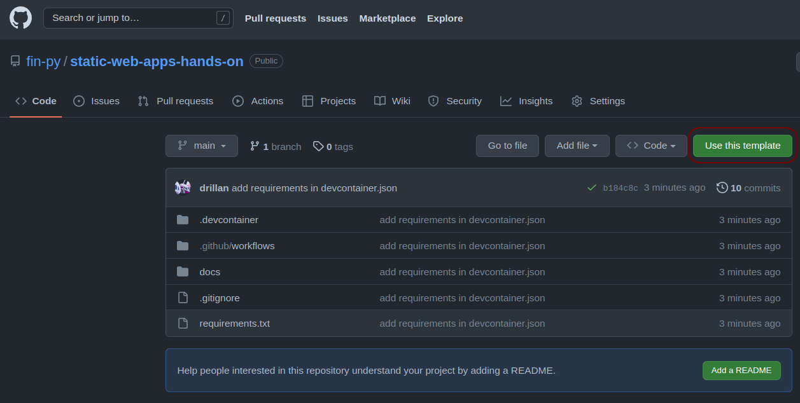
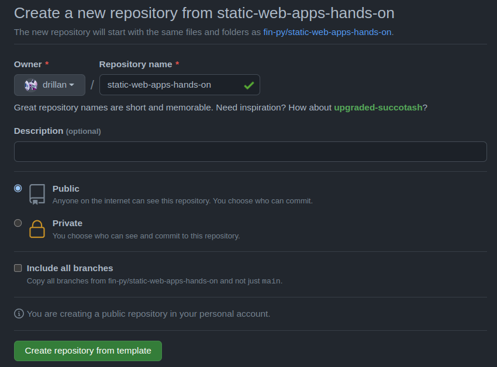
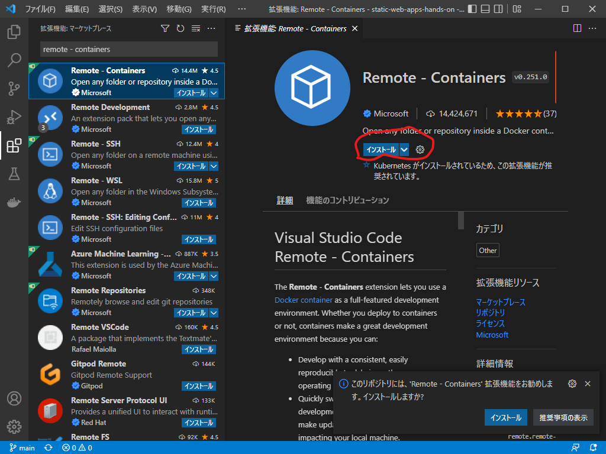
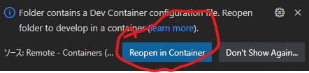

環境構築
========

ハンズオンのリポジトリにアクセスし、 `Use this template` をクリックします（ :numref:`use-this-template` ）。

https://github.com/fin-py/static-web-apps-hands-on

   
   Use this template

「Create a new repository from static-web-apps-hands-on」の画面で、Repository nameに `static-web-apps-hands-on` を入力し、 `Create repository from template` をクリックします（ :numref:`create-a-new-repository` ）。

   
   Use this template

:numref:`clone-repository` のコマンドを実行して、ハンズオンのリポジトリをクローンします。 `<your-github-username>` は適宜置き換えてください。

.. code-block:: bash
   :name: clone-repository
   :caption: リポジトリのクローン

   git clone https://github.com/<your-github-username>/static-web-apps-hands-on.git

.. note::

   PCにGitがインストールされていない場合はzipファイルをダウンロードして展開します

   https://github.com/<your-github-username>/static-web-apps-hands-on/archive/refs/heads/main.zip

:numref:`launch-vscode` のコマンドを実行してVS Codeを起動します。

.. code-block:: bash
   :name: launch-vscode
   :caption: VS Codeの起動

   cd static-web-apps-hands-on.git
   code .

VS Codeの拡張から、 `Remote - Containers` を検索し、インストールします（ :numref:`install-remote-containers` ）。

   
   Remote - Containers拡張のインストール

:numref:`reopen-in-container` の画面がでたら、 `Reopen in Contaier` をクリックします。

   Reopen in Contaier

.. caution::

   初回はDev Containerを構築するため、時間がかかります。